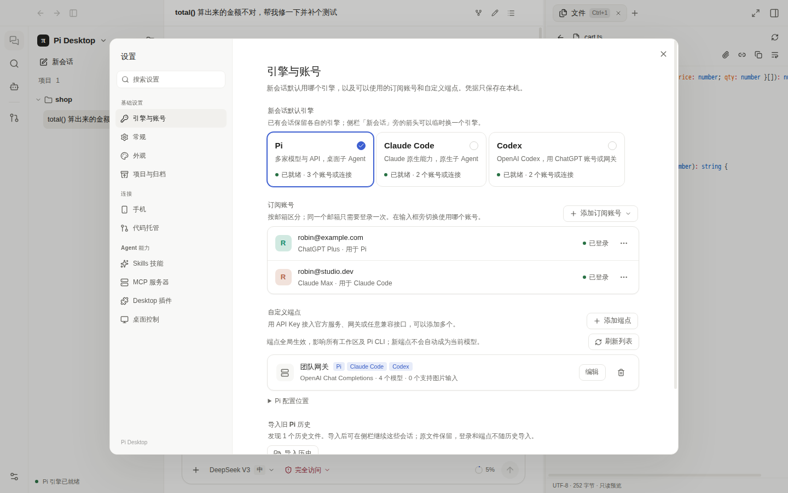
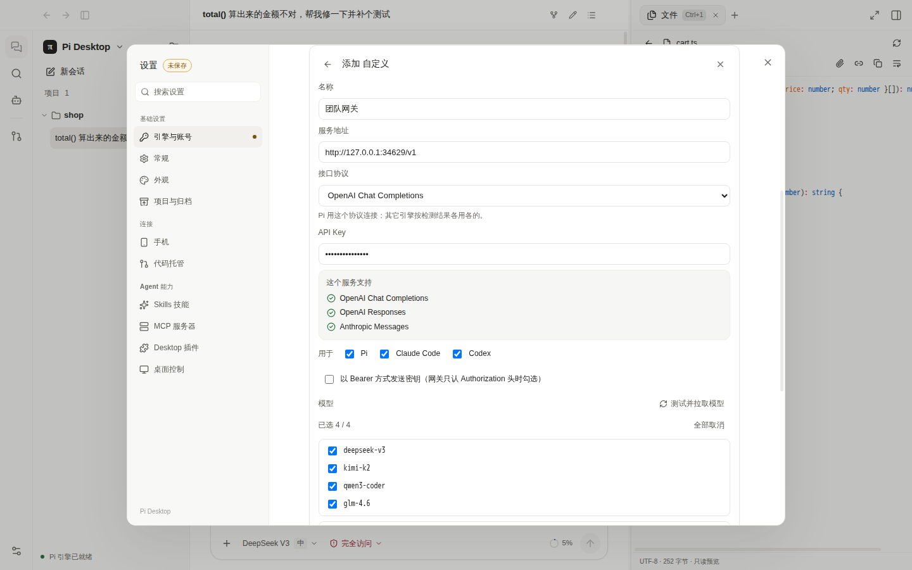
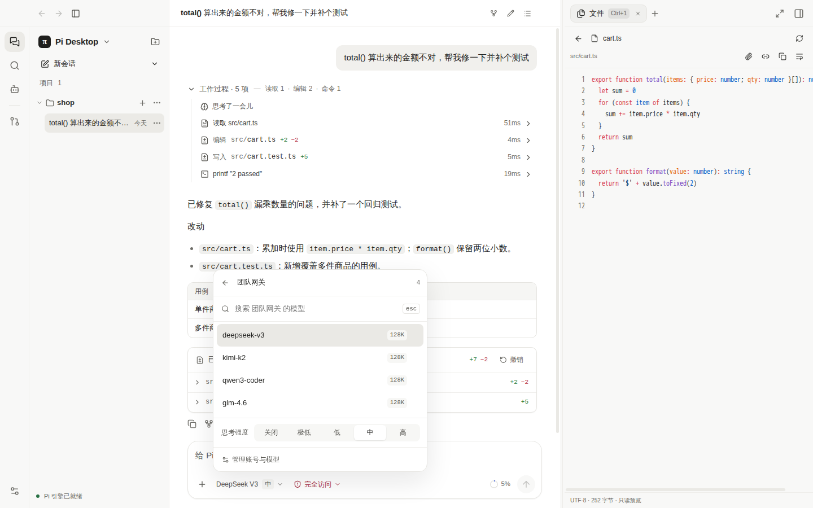
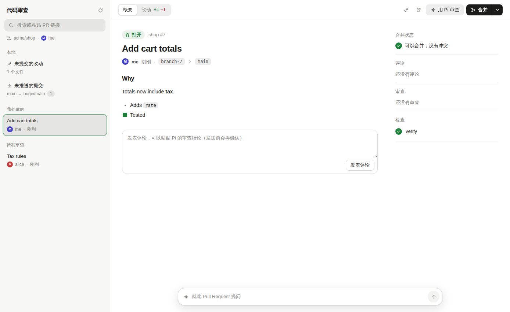

<div align="center">


# Pi Desktop

**一个应用，三个编程 Agent**：Pi、Claude Code、Codex 的桌面图形界面，按会话随时切换。

[](https://github.com/xingmolu/pi-workbench/releases)
[](./LICENSE)
[](https://github.com/xingmolu/pi-workbench/stargazers)


[下载](https://github.com/xingmolu/pi-workbench/releases) · [功能](#功能) · [开始使用](#开始使用) · [从源码构建](#从源码构建) · [English](./README.en.md)

</div>


## 为什么用它

- **不用在三个终端之间来回切**：同一个项目里，这个会话用 Pi 接 DeepSeek，那个会话用 Claude Code，再开一个用 Codex，各跑各的。
- **一个 ChatGPT 订阅，两个引擎都能用**：在 Pi 里登录一次，Codex 直接借用，不用再登录。
- **一个网关，三个引擎都能用**：地址和 Key 只填一次，自动识别它支持的 OpenAI / Anthropic 协议，能用的引擎自动勾上，模型列表一并拉取。
- **看得见、能撤销**：每一步读了什么、改了什么都摊开给你看，改文件前可以先审批，整轮改动一键撤销。
- **本地运行，不收集数据**：账号和密钥只存在你的电脑上。开源，MIT 许可。

Pi Desktop 是一个本地运行的桌面应用（Electron + React）。它直接嵌入
[Pi coding agent](https://www.npmjs.com/package/@earendil-works/pi-coding-agent)，
Claude Code 和 Codex 则在第一次使用时从官方 npm 包下载。

> 这是一个社区项目，与 Pi 项目、Anthropic、OpenAI 均无官方关联。目前处于早期测试阶段，欢迎试用和反馈；觉得有用的话，点个 ⭐ 能让更多人看到它。

## 功能

**三个引擎，按会话切换**
- **Pi**：支持多家模型。可以用 ChatGPT 订阅登录，也可以填 API Key（OpenRouter、DeepSeek、Kimi、Anthropic，或任何 OpenAI / Anthropic 兼容的网关）。
- **Claude Code**：官方 Claude Agent SDK，用 Claude 订阅，或任何 Anthropic 兼容的 API / 网关（支持 `x-api-key` 和 Bearer 两种认证）。
- **Codex**：官方 Codex CLI，用你在 Pi 里登录的 ChatGPT 账号（第一次使用时会询问是否授权），或任何提供 OpenAI Responses 接口的网关。
- Claude Code 和 Codex 的程序不打进安装包，第一次使用时从官方 npm 包下载，按固定的校验值核对；下载中断可以续传。

**模型与网关**

「设置 › 引擎与账号」里，订阅账号按邮箱列出，API Key 和网关一个服务一行，标出哪些引擎在用它。



添加网关时，地址和 Key 只填一次。点「测试并拉取模型」会检测它支持哪些协议（不消耗 token），能用的引擎自动勾上：

| 引擎 | 用哪种协议 |
|---|---|
| Pi | OpenAI Chat Completions、OpenAI Responses、Anthropic Messages 任一种 |
| Claude Code | Anthropic Messages（网关根路径或 `/anthropic`，`x-api-key` 或 Bearer 认证都会自动识别） |
| Codex | OpenAI Responses |

<table>
<tr>
<td width="50%"></td>
<td width="50%"></td>
</tr>
<tr>
<td align="center">检测协议，选择用于哪些引擎</td>
<td align="center">在输入框里切换账号和模型</td>
</tr>
</table>

**看得见、管得住的工作过程**
- 每一轮的读取、编辑、命令都折叠成「工作过程」，展开可看详情与耗时。
- 改动以 diff 展示，整轮改动可以一键撤销；之后被手动改过的文件会先提醒。
- 三档权限：请求批准 / 帮我批准常规操作 / 完全访问；「总是允许」会记成项目规则。
- 同一项目可并行多个会话，各自独立运行、停止和审批；支持子 Agent，可单独查看它的对话记录。


**工作台**
- 四栏布局：活动栏、项目和会话、对话、工作台；标题栏可以前进 / 后退，工作台可以最大化。
- 工作台工具：文件、改动审查、Git（暂存、提交、推送，可根据改动生成提交信息）、终端、浏览器（每个网页一个标签，Agent 可以操作）；`⌘/Ctrl + 1…9` 切换标签，空工作台列出工具和最近访问的网站。
- 代码审查：未提交的改动、未推送的提交和 GitHub 拉取请求放在一处看 diff、合并、评论；可以「用 Pi 审查」，也可以直接就某个拉取请求提问。



- MCP 服务器（含 HTTP 服务器的 OAuth 登录）、Skills 技能、插件（视图、命令、Agent 工具、主题；可从文件夹、zip 或 Git 地址安装和更新）。
- 手机端：在同一局域网用配对码连接，或通过 Tailscale 从外网访问；可以在手机上看进度、批准操作、继续对话。

<p align="center"></p>

**日常好用**
- 中英文界面：默认跟随系统语言，也可以在「设置 › 常规」里切换。
- 订阅额度查询、模型选择器（能力标签、最近使用）、会话搜索与归档、浅色 / 深色主题和强调色。
- 新会话第一轮结束后自动起标题；标题和提交信息优先用小而快的模型生成，可以在「设置 › 常规」里指定模型或关闭。
- 应用内检查更新；出问题时可以在设置里导出诊断报告（会自动去掉密钥和令牌）。

## 开始使用

### 1. 下载安装

从 [Releases](https://github.com/xingmolu/pi-workbench/releases) 下载对应平台的安装包。`main` 分支每次测试全部通过都会自动发布一个测试版。

| 系统 | 文件 | 第一次打开 |
|---|---|---|
| macOS（Apple 芯片 / Intel） | `pi-desktop-<版本>-arm64.dmg` / `-x64.dmg` | 目前未经 Apple 公证，拖进「应用程序」后右键选「打开」；或在终端执行 `xattr -dr com.apple.quarantine "/Applications/Pi Desktop.app"` |
| Windows | `pi-desktop-<版本>-setup.exe` | 未签名，SmartScreen 提示时点「更多信息 → 仍要运行」 |
| Linux | `.AppImage` 或 `.deb` | AppImage 需先 `chmod +x` |

Windows 和 AppImage 可以在应用内直接更新；macOS 和 deb 会打开下载页让你手动下载新版本。

### 2. 打开项目，连接模型

打开应用、选择一个项目文件夹。如果还没有可用的账号，首页会列出可选的连接方式：

- **ChatGPT 账号**：在浏览器里登录 Plus / Pro 订阅，Pi 和 Codex 都能用。
- **API Key / 网关**：在「设置 › 引擎与账号 › 添加端点」里选服务商或「自定义」，填地址和 Key，点「测试并拉取模型」，见上面的[模型与网关](#功能)。
- **Claude 账号**：切换到 Claude Code 引擎，下载后登录。

### 3. 开始工作

在输入框里描述任务即可。常用快捷键：

| 快捷键 | 作用 |
|---|---|
| `⌘/Ctrl + K` | 命令面板（搜索会话、执行命令） |
| `⌘/Ctrl + N` | 新建会话 |
| `⌘/Ctrl + P` | 搜索项目文件 |
| `⌘/Ctrl + J` | 打开终端 |
| `⌘/Ctrl + 1…9` | 切换工作台标签 |
| `⌘/Ctrl + [` / `]` | 后退 / 前进 |
| `⌘/Ctrl + \` | 展开 / 收起工作台 |

## 隐私与安全

- 账号、API Key 和会话记录都保存在本机；Pi Desktop 本身不收集使用数据（各引擎程序自身的行为以其官方说明为准）。
- Codex 借用 ChatGPT 账号时，只拿到短期访问令牌，刷新令牌始终留在 Pi 里，授权可以随时撤销。
- 插件在设置里从文件夹、zip 或 Git 地址安装，安装前列出它请求的权限。也可以在设置里新建插件或直接加载插件文件夹，保存即自动重新加载（见 [PLUGINS.md](./PLUGINS.md) §22 和 `examples/plugins/`）。插件页面运行在沙箱里；会运行代码的插件以你的账户权限运行（和编辑器扩展一样），只安装来自可信来源的插件。插件通过接口写文件时按当前权限档位审批。
- 诊断信息只保存在本机；导出的报告会去掉密钥、令牌和用户目录，由你决定是否分享。

## 从源码构建

需要 Node.js 22 和 Git。

```bash
git clone https://github.com/xingmolu/pi-workbench.git
cd pi-workbench
npm ci
npm run dev        # 开发模式
npm run demo       # 离线演示：使用本地假模型，不需要任何账号
npm test           # 单元测试
npm run test:e2e   # 端到端测试（Playwright + Electron）
npm run build && npx electron-builder --linux   # 打包（或 --win；macOS 先运行 npm run build:native:mac 再 --mac）
# 重新生成 README 截图：步骤见 tests/e2e/readme-screenshots.spec.ts 开头
```

架构、实现细节和测试方法见 [DEVELOPMENT.md](./DEVELOPMENT.md)；插件开发见 [PLUGINS.md](./PLUGINS.md)；
引擎接入见 [docs/architecture](./docs/architecture/agent-runtime-providers.md)。

## 参与贡献

欢迎提 Issue 和 Pull Request，详见 [CONTRIBUTING.md](./CONTRIBUTING.md)。安全问题请按 [SECURITY.md](./SECURITY.md) 私下报告。

## 许可

[MIT](./LICENSE)。Claude Code 与 Codex 的命令行程序不随本项目分发，使用时请遵守它们各自的条款。
