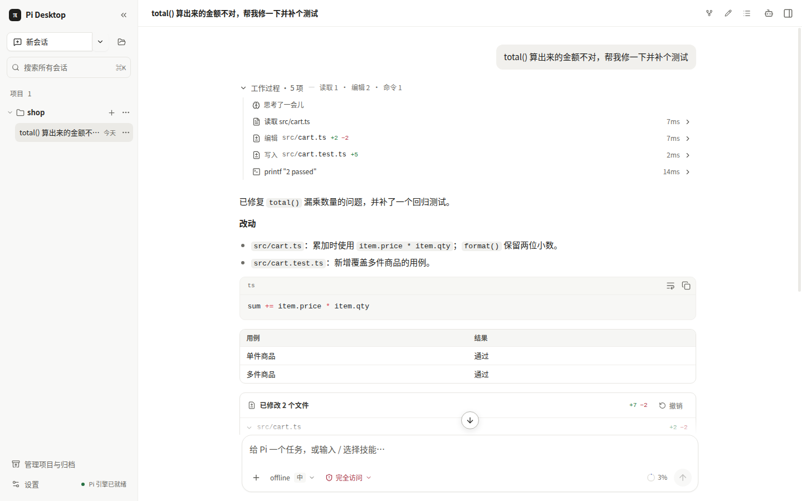
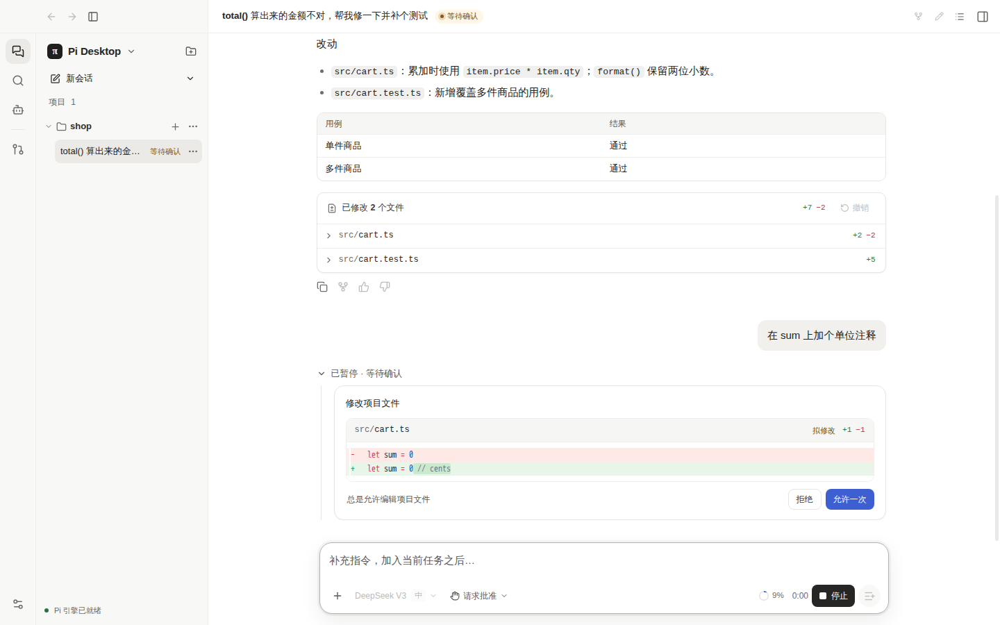
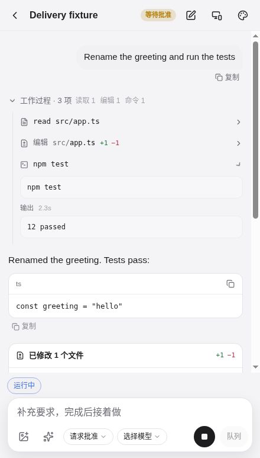
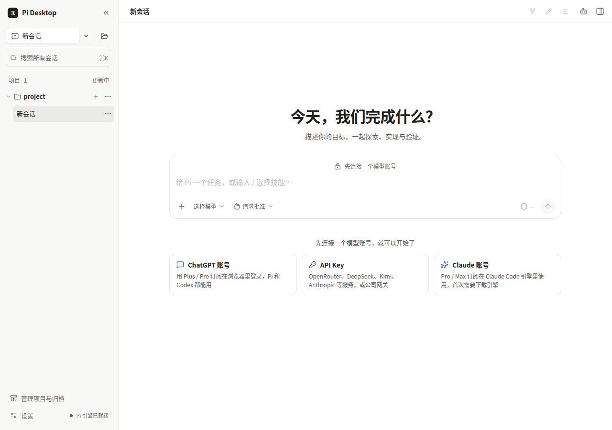

<div align="center">

# Pi Desktop

**编程 Agent 的桌面工作台**：一个应用里使用 Pi、Claude Code 和 Codex。

[下载](https://github.com/xingmolu/pi-workbench/releases) · [功能](#功能) · [开始使用](#开始使用) · [从源码构建](#从源码构建) · [English](./README.en.md)

</div>



Pi Desktop 是一个本地运行的桌面应用（Electron + React），把命令行里的编程 Agent 搬进一个更顺手的界面：
在项目里同时开多个会话，每一步做了什么、改了哪些文件都看得见，改动前可以先审批、改完可以一键撤销。

它直接嵌入 [Pi coding agent](https://www.npmjs.com/package/@earendil-works/pi-coding-agent)，
也可以切换到 Claude Code 或 Codex 引擎。账号和密钥只保存在你的电脑上。

> 这是一个社区项目，与 Pi 项目、Anthropic、OpenAI 均无官方关联。目前处于早期测试阶段，欢迎试用和反馈。

## 功能

**三个引擎，按会话切换**
- **Pi**：支持多家模型。可以用 ChatGPT 订阅登录，也可以填 API Key（OpenRouter、DeepSeek、Kimi、Anthropic，或任何 OpenAI / Anthropic 兼容的网关）。
- **Claude Code**：官方 Claude Agent SDK，支持 Claude 订阅或 API Key。
- **Codex**：官方 Codex CLI，直接用你在 Pi 里登录的 ChatGPT 账号，第一次使用时会询问是否授权。
- Claude Code 和 Codex 的程序不打进安装包，第一次使用时从官方 npm 包下载，按固定的校验值核对；下载中断可以续传。

**看得见、管得住的工作过程**
- 每一轮的读取、编辑、命令都折叠成「工作过程」，展开可看详情与耗时。
- 改动以 diff 展示，整轮改动可以一键撤销；之后被手动改过的文件会先提醒。
- 三档权限：请求批准 / 帮我批准常规操作 / 完全访问；「总是允许」会记成项目规则。
- 同一项目可并行多个会话，各自独立运行、停止和审批；支持子 Agent，可单独查看它的对话记录。



**工作台**
- 内置浏览器（Agent 可以操作）、终端、Git（暂存、提交、推送）、文件浏览。
- MCP 服务器（含 HTTP 服务器的 OAuth 登录）、Skills 技能、插件（视图、命令、Agent 工具、主题；可从文件夹、zip 或 Git 地址安装和更新）。
- 手机端：在同一局域网用配对码连接，或通过 Tailscale 从外网访问；可以在手机上看进度、批准操作、继续对话。

<p align="center"></p>

**日常好用**
- 中英文界面：默认跟随系统语言，也可以在「设置 › 常规」里切换。
- 订阅额度查询、模型选择器（能力标签、最近使用）、会话搜索与归档、浅色 / 深色主题和强调色。
- 应用内检查更新；出问题时可以在设置里导出诊断报告（会自动去掉密钥和令牌）。

## 开始使用

### 1. 下载安装

从 [Releases](https://github.com/xingmolu/pi-workbench/releases) 下载对应平台的安装包。`main` 分支每次测试全部通过都会自动发布一个测试版。

| 系统 | 文件 | 第一次打开 |
|---|---|---|
| macOS（Apple 芯片 / Intel） | `pi-desktop-<版本>-arm64.dmg` / `-x64.dmg` | 目前未经 Apple 公证，拖进「应用程序」后右键选「打开」；或在终端执行 `xattr -dr com.apple.quarantine "/Applications/Pi Desktop.app"` |
| Windows | `pi-desktop-<版本>-setup.exe` | 未签名，SmartScreen 提示时点「更多信息 → 仍要运行」 |
| Linux | `.AppImage` 或 `.deb` | AppImage 需先 `chmod +x` |

Windows 和 AppImage 可以在应用内直接更新；macOS 和 deb 会打开下载页让你手动下载新版本。

### 2. 打开项目，连接模型

打开应用、选择一个项目文件夹。如果还没有可用的账号，首页会列出可选的连接方式：



- **ChatGPT 账号**：在浏览器里登录 Plus / Pro 订阅，Pi 和 Codex 都能用。
- **API Key**：在「设置 › 引擎与账号 › 添加 API 连接」里选服务商、填 Key。
- **Claude 账号**：切换到 Claude Code 引擎，下载后登录。

### 3. 开始工作

在输入框里描述任务即可。`⌘/Ctrl + K` 打开命令面板，`⌘/Ctrl + J` 切换终端，`⌘/Ctrl + N` 新建会话。

## 隐私与安全

- 账号、API Key 和会话记录都保存在本机；Pi Desktop 本身不收集使用数据（各引擎程序自身的行为以其官方说明为准）。
- Codex 借用 ChatGPT 账号时，只拿到短期访问令牌，刷新令牌始终留在 Pi 里，授权可以随时撤销。
- 插件在设置里从文件夹、zip 或 Git 地址安装，安装前列出它请求的权限。插件页面运行在沙箱里；会运行代码的插件以你的账户权限运行（和编辑器扩展一样），只安装来自可信来源的插件。插件通过接口写文件时按当前权限档位审批。
- 诊断信息只保存在本机；导出的报告会去掉密钥、令牌和用户目录，由你决定是否分享。

## 从源码构建

需要 Node.js 22 和 Git。

```bash
git clone https://github.com/xingmolu/pi-workbench.git
cd pi-workbench
npm ci
npm run dev        # 开发模式
npm run demo       # 离线演示：使用本地假模型，不需要任何账号
npm test           # 单元测试
npm run test:e2e   # 端到端测试（Playwright + Electron）
npm run build && npx electron-builder --linux   # 打包（或 --win；macOS 先运行 npm run build:native:mac 再 --mac）
```

架构、实现细节和测试方法见 [DEVELOPMENT.md](./DEVELOPMENT.md)；插件开发见 [PLUGINS.md](./PLUGINS.md)；
引擎接入见 [docs/architecture](./docs/architecture/agent-runtime-providers.md)。

## 参与贡献

欢迎提 Issue 和 Pull Request，详见 [CONTRIBUTING.md](./CONTRIBUTING.md)。安全问题请按 [SECURITY.md](./SECURITY.md) 私下报告。

## 许可

[MIT](./LICENSE)。Claude Code 与 Codex 的命令行程序不随本项目分发，使用时请遵守它们各自的条款。
